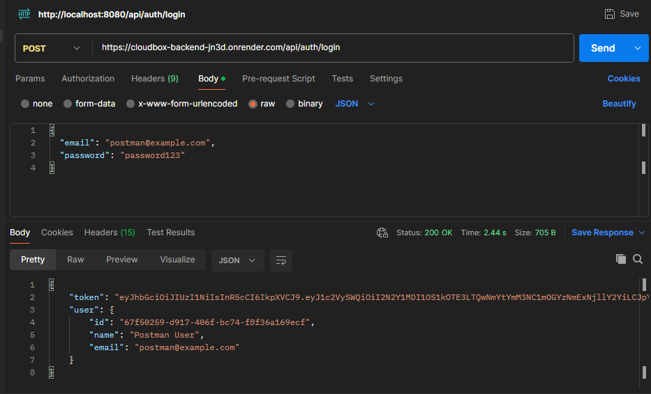
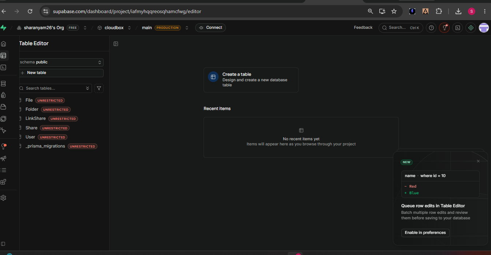
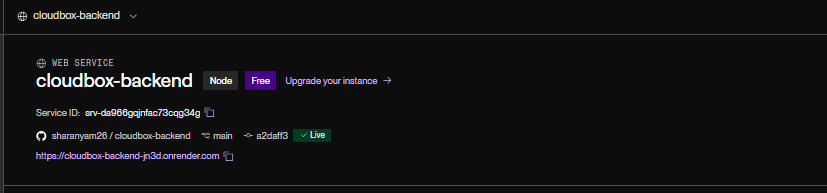

# Cloudbox — Backend

Node.js + Express REST API for a cloud file storage and sharing service (Google Drive-style),
using Prisma ORM, Supabase (PostgreSQL + Storage), JWT auth, and Google OAuth.

**Live API:** https://cloudbox-backend-jn3d.onrender.com

## Features
- Email/password authentication (JWT) + Google OAuth
- Nested folder management
- File upload/download via Supabase Storage
- File/folder sharing with Viewer/Editor roles
- Public share links with optional password and expiry
- Search
- Starred files/folders
- Trash and restore (soft delete)

## Tech Stack
- Node.js, Express
- Prisma ORM
- PostgreSQL (Supabase)
- Supabase Storage
- JWT (jsonwebtoken), bcrypt
- Google OAuth (google-auth-library)
- Deployed on Render

## Setup

\`\`\`bash
npm install
\`\`\`

Create a `.env` file:
\`\`\`
DATABASE_URL=your_supabase_postgres_url
JWT_SECRET=your_jwt_secret
SUPABASE_URL=your_supabase_project_url
SUPABASE_SERVICE_ROLE_KEY=your_supabase_service_role_key
SUPABASE_BUCKET=cloudbox-files
GOOGLE_CLIENT_ID=your_google_oauth_client_id
PORT=8080
\`\`\`

Run migrations:
\`\`\`bash
npx prisma migrate dev
\`\`\`

Start the server:
\`\`\`bash
npm run dev
\`\`\`

## API Endpoints

| Method | Endpoint | Description |
|---|---|---|
| POST | /api/auth/register | Register with email/password |
| POST | /api/auth/login | Login with email/password |
| POST | /api/auth/google | Login/register with Google OAuth |
| GET | /api/auth/me | Get current user |
| GET/POST | /api/folders | List/create folders |
| PATCH | /api/folders/:id/rename | Rename folder |
| POST | /api/folders/:id/trash | Move folder to trash |
| POST | /api/folders/:id/restore | Restore folder |
| GET/POST | /api/files | List/upload files |
| GET | /api/files/:id/download | Download a file |
| POST | /api/shares | Share a file/folder with a user |
| GET | /api/shares/with-me | List items shared with me |
| POST | /api/link-shares | Generate a public share link |
| GET | /api/public/:token | Access a resource via public link |
| GET | /api/search?q= | Search files and folders |

## Screenshots

### Authentication (Postman)

### Database (Supabase)

### Deployment (Render)
